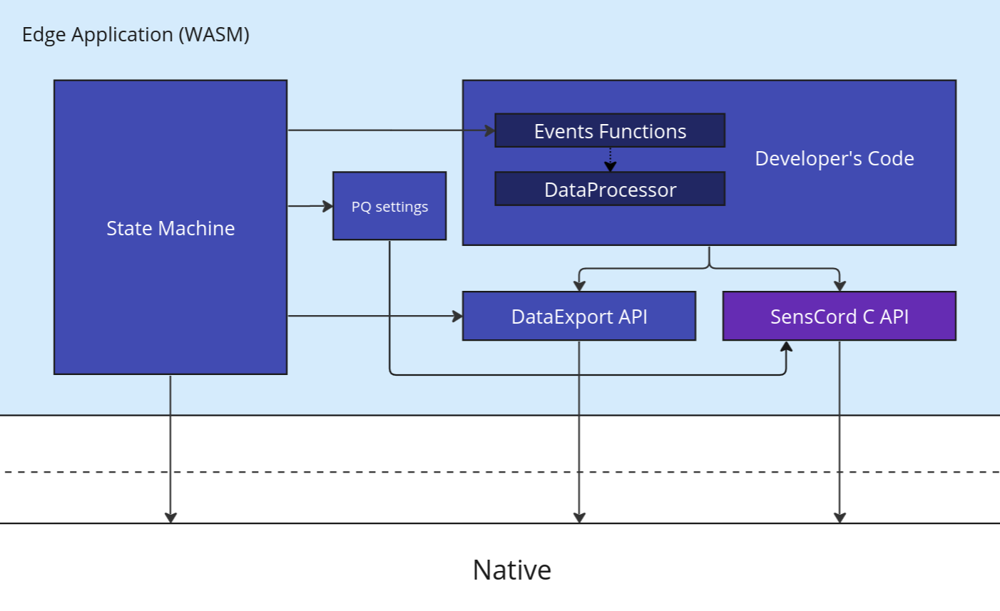
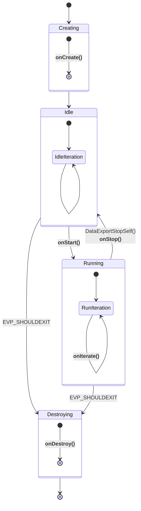
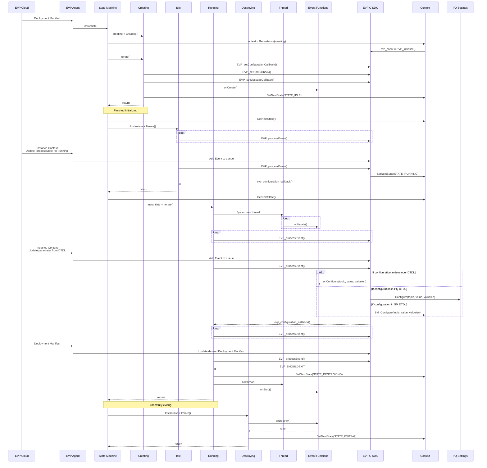

# Edge Application Desgin document

## Event-based architecture documentation

The "**Edge Application**" design is following an event-based architecture approach that allows a developer to focus on implementing only the app-specific code. To this end they should provide the event functions declared in [**`sm.h`**](../include/sm.h). 

  

These event functions are further used by the State Machine. The life cycle of an application is depicted in the [following state diagram](#state-machine-diagram) that outlines the transitions and events within the Event-based architecture.

The states include Creating, Running, Idle, and Destroying, with transitions triggered by specific events. In each of this states, event functions declared in [**`sm.h`**](../include/sm.h) are called. Here is a description of the states:

## State Machine Diagram

This state diagram outlines the transitions and events within the Event-based architecture, depicting the life cycle of an application.

>**NOTE**
>
>Functions written in bold are called by a state or by the state machine, but not the triggers of the state change.

Triggers of change state:

- `DataExportStopSelf()` notifies state machine to transition from Running to Idle state.
- Cloud modification of process state. E.g., from Running to Idle or Idle to Running.
- Deployment of a new application, which implies a `EVP_SHOULDEXIT`.

The states include Creating, Running, Idle, and Destroying, with transitions triggered by specific events. In each of this states, event functions defined in `sm.h` are called.

Here's a description of the diagram:

- **Creating**: The initial state where the application is created. It transitions to the Idle state.

- **Running**: The active state where the application is running. It can transition back to itself, representing the continuity of the application. The transition to Idle is through the application calling `DataExportStopSelf()` or by a DTDL modification from the cloud. This transition triggers `onStop()` event function, indicating a pause in execution.

- **Idle**: A passive state indicating a paused or idle state of the application. It transitions back to itself, symbolizing the idle state's persistence.

- **Destroying**: Any state can transition to the Destroying state under certain conditions. Errors or the presence of `EVP_SHOULDEXIT` conditions during the Running or Idle state, trigger transitions to the Destroying state. Once in the Destroying state, the `onDestroy()` event function is invoked, representing the final cleanup or termination of the application. After this event, the system transitions exits gracefully.

## Sequence Diagram

This sequence diagram illustrates the three primary transitions: the state machine begins by executing the Creating state to initialize the components. Following that, it shifts to the Running state, where a sequence of iterations occurs. This iterative process continues until a new cloud deployment takes place, which results in the removal of the current application to make way for the initiation of another one.

Components included in the diagram:
* EVP
    * Cloud
    * Agent
* State Machine & States
* Event Functions
* PQ Context

