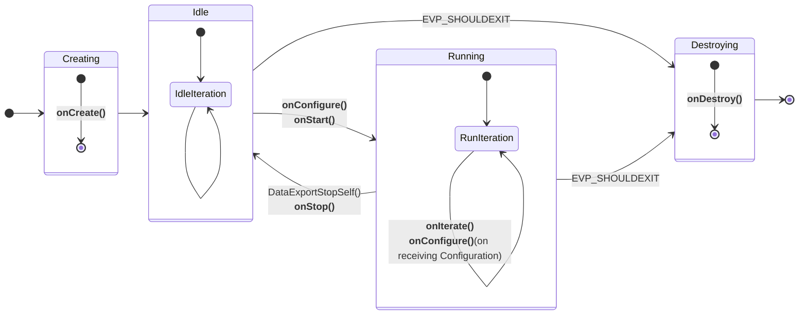

## 1. Event-based architecture of Edge Application

The "**Edge Application**" design is following an event-based architecture approach that allows developers to focus on implementing only the app-specific code. To this end they should provide the event functions declared in [**`sm.h`**](https://github.com/SonySemiconductorSolutions/aitrios-sdk-edge-app/blob/main/include/sm.h). 

```C title="sm.h"
int onCreate();
int onConfigure(char *topic, void *value, int valuelen);
int onIterate();
int onStop();
int onStart();
int onDestroy();
```

These event functions are further used by the State Machine. The life cycle of an application is depicted in the following state diagram that outlines the transitions and events within the Event-based architecture.



The states include Creating, Idle, Running and Destroying, with transitions triggered by specific events. In each of this states, event functions declared in [**`sm.h`**](https://github.com/SonySemiconductorSolutions/aitrios-sdk-edge-app/blob/main/include/sm.h) are called. 

??? abstract "Description of each states"

    * **Creating**: The initial state where the application is created. Inside it calls the **`onCreate()`** event function and upon finishing its execution the state machine transitions to the Idle state.

    * **Idle**: A passive state indicating a paused or idle state of the application. It transitions back to itself, symbolizing the idle state's persistence. Alternatively, it transitions to Running state upon the call from the system app.

    * **Running**: The active state where the application is running and executing the  **`onIterate()`** event function. When creating this state, an **`onStart()`** event function is called. The state can transition back to itself, representing the continuity of the application. The transition to Idle is through the application calling **`DataExportStopSelf()`** or by a DTDL modification from the cloud. This transition triggers **`onStop()`** event function, indicating a pause in execution.

    * **Destroying**: Any state can transition to the Destroying state under certain conditions. Errors or the presence of **`EVP_SHOULDEXIT`** conditions during the Running or Idle state, trigger transitions to the Destroying state. Once in the Destroying state, the **`onDestroy()`** event function is invoked, representing the final cleanup or termination of the application. After this event, the system transitions exits gracefully.

??? tip "Tip: custom_settings"

    Running and Idle states call the event function **`onConfigure(char *topic, void *value, int valuelen)`** when receiving a changed DTDL from the cloud. Note that the **`topic`** will point to the **`custom_settings`** string while **`value`** will point to a string with the **`custom_settings`** field of the DTDL, for example, that will have the following structure:

    ```json
    {
    "custom_settings": {
        "res_info": {
        "res_id": "GENERATED_STRING-tzmks",
        "code": 7,
        "detail_msg": "GENERATED_STRING-jfgfb"
        },
        "ai_models": {
        "GENERATED_STRING-tvipc": {
            "ai_model_bundle_id": "GENERATED_STRING-cvyee",
            "parameters": {
            "max_detections": 8,
            "threshold": 0.125,
            "input_width": 8,
            "input_height": 4
            }
        }
        }
    }
    }
    ```  

    The content of **`custom_settings`** field is decided by the developers.

    > **NOTE**
    > 
    > **`ai_model_bundle_id`** specifies which AI model on a Edge AI Device to use. The code to read and set **`ai_model_bundle_id`** in **`onConfigure(char *topic, void *value, int valuelen)`** is included in sample code.

## 2. Define DTDL for Custom Parameters

!!! warning  
    Do not edit the parameters that cannot be customized: **`req_info`**, **`res_info`** and **`common_settings`**. If you edit it, the app may not work properly.

The Custom Parameters are used to configure the "**Edge Application**". The developers can set their own settings for the app.

The DTDL of "**Edge Application**" has the following structure.

- **`edge_app`**  
    - **`req_info`**
    - **`res_info`**
    - **`common_settings`**
    - **`custom_settings`**

The developers need to define the DTDL for **`custom_settings`**.<br>
See [**`edge_app_interface.json`**](https://github.com/SonySemiconductorSolutions/aitrios-sdk-edge-app/blob/main/tutorials/1_develop_edge_app/edge_app_interface.json) for an example DTDL for "**Edge Application**".<br>
See also [**`DTDL Language Specification`**](https://github.com/Azure/opendigitaltwins-dtdl/blob/master/DTDL/v3/DTDL.Specification.v3.md) for DTDL specifications.

Each sample app provides DTDL and a sample of Configuration that is sent from the cloud to the app, so please refer to them.

| Sample app | DTDL | Configuration sample |
|------------|------|----------------------|
| Image classification  | [**`edge_app_ic_interface.json`**](https://github.com/SonySemiconductorSolutions/aitrios-sdk-edge-app/blob/main/sample_apps/classification/package/edge_app_ic_interface.json) | [**`configuration.json`**](https://github.com/SonySemiconductorSolutions/aitrios-sdk-edge-app/blob/main/sample_apps/classification/configuration/configuration.json) |
| Object detection      | [**`edge_app_od_interface.json`**](https://github.com/SonySemiconductorSolutions/aitrios-sdk-edge-app/blob/main/sample_apps/detection/package/edge_app_od_interface.json) | [**`configuration.json`**](https://github.com/SonySemiconductorSolutions/aitrios-sdk-edge-app/blob/main/sample_apps/detection/configuration/configuration.json) |
| Semantic segmentation | [**`edge_app_ss_interface.json`**](https://github.com/SonySemiconductorSolutions/aitrios-sdk-edge-app/blob/main/sample_apps/segmentation/package/edge_app_ss_interface.json) | [**`configuration.json`**](https://github.com/SonySemiconductorSolutions/aitrios-sdk-edge-app/blob/main/sample_apps/segmentation/configuration/configuration.json) |
| Switch DNN | [**`edge_app_switch_dnn_interface.json`**](https://github.com/SonySemiconductorSolutions/aitrios-sdk-edge-app/blob/main/sample_apps/switch_dnn/package/edge_app_switch_dnn_interface.json) | [**`configuration.json`**](https://github.com/SonySemiconductorSolutions/aitrios-sdk-edge-app/blob/main/sample_apps/switch_dnn/configuration/configuration.json) |


## 3. Output post-processing result

The "**Edge Application**" provides two format of sending post-processing result.

- Serialization with a FlatBuffers schema
- JSON

=== "FlatBuffers"
    "**Edge Application**" output is serialized by [FlatBuffers](https://google.github.io/flatbuffers/index.html) and send it as a telemetry. To this end, a developer needs to define the FlatBuffers schema file (`.fbs` extension) for its "**Edge Application**" output.


    Then, in order to use the FlatBuffers Schema inside the C/C++ code of the "**Edge Application**", one needs to generate the corresponding C header files. 

    To generate a C header file from an `.fbs` schema file, please refer to the official documentation: [https://flatbuffers.dev/flatc/](https://flatbuffers.dev/flatc/).

    Each sample app provides an example of the sample FlatBuffers schema file and a C header file generated from the corresponding FlatBuffers schema file. A reader is welcome to check that the generated headers are exactly the same as provided in the repo (up to formatting the code).

    | Sample app            | FlatBuffers Schema                                                                            | C   header                                                               |
    |-----------------------|-----------------------------------------------------------------------------------------------|--------------------------------------------------------------------------|
    | Image classification  | [classification.fbs](https://github.com/SonySemiconductorSolutions/aitrios-sdk-edge-app/tree/main/sample_apps/classification/schemas/classification.fbs)             | [classification_generated.h](https://github.com/SonySemiconductorSolutions/aitrios-sdk-edge-app/tree/main/sample_apps/classification/include/schemas/classification_generated.h)        |
    | Object detection      | [objectdetection.fbs](https://github.com/SonySemiconductorSolutions/aitrios-sdk-edge-app/tree/main/sample_apps/detection/schemas/objectdetection.fbs)                | [objectdetection_generated.h](https://github.com/SonySemiconductorSolutions/aitrios-sdk-edge-app/tree/main/sample_apps/detection/include/schemas/objectdetection_generated.h)            |
    | Semantic segmentation | [semantic_segmentation.fbs](https://github.com/SonySemiconductorSolutions/aitrios-sdk-edge-app/tree/main/sample_apps/segmentation/schemas/semantic_segmentation.fbs) | [semantic_segmentation_generated.h](https://github.com/SonySemiconductorSolutions/aitrios-sdk-edge-app/tree/main/sample_apps/segmentation/include/schemas/semantic_segmentation_generated.h) |
    | Switch DNN | [switch_dnn_classification.fbs](https://github.com/SonySemiconductorSolutions/aitrios-sdk-edge-app/tree/main/sample_apps/switch_dnn/schemas/switch_dnn_classification.fbs)  and [switch_dnn_objectdetection.fbs](https://github.com/SonySemiconductorSolutions/aitrios-sdk-edge-app/tree/main/sample_apps/switch_dnn/schemas/switch_dnn_objectdetection.fbs)| [switch_dnn_classification_generated.h](https://github.com/SonySemiconductorSolutions/aitrios-sdk-edge-app/tree/main/sample_apps/switch_dnn/include/schemas/switch_dnn_classification_generated.h) and [switch_dnn_objectdetection_generated.h](https://github.com/SonySemiconductorSolutions/aitrios-sdk-edge-app/tree/main/sample_apps/switch_dnn/include/schemas/switch_dnn_objectdetection_generated.h) |
    
    !!! tip
        To get familiar with writing a FlatBuffers schema see the [Writing a schema](https://google.github.io/flatbuffers/flatbuffers_guide_writing_schema.html) in FlatBuffers documents.


=== "JSON"
    Object detection and Classification sample apps provide an example of output json text format.

    These sample apps also provide examples of a binary output serialized by FlatBuffers. The output formats can be specified by `custom_settings` - `metadata_settings` - `format` in configuration json.

    ??? example "Example: detection sample"

        In [**`detection_data_processor.cpp`**](https://github.com/SonySemiconductorSolutions/aitrios-sdk-edge-app/tree/main/sample_apps/detection/data_processor/src/detection_data_processor.cpp), `DataProcessorAnalyze` makes serialized json string.

        ```detection_data_processor.cpp
            case EdgeAppLibSendDataJson: {
            JSON_Value *tensor_output =
                CreateSSDOutputJson(in_data, in_size / sizeof(float), analyze_params);
            *out_data = json_serialize_to_string(tensor_output);
            *out_size = json_serialization_size(tensor_output);
            json_value_free(tensor_output);
            return kDataProcessorOk;
            }
        ```

        In [**`sm.cpp`**](https://github.com/SonySemiconductorSolutions/aitrios-sdk-edge-app/tree/main/sample_apps/detection/src/sm.cpp), `sendMetadata` calls `SendDataSyncMeta` API with data format as `EdgeAppLibSendDataJson` returned from `DataProcessorGetDataType()`.

        ```sm.cpp
        EdgeAppLibSendDataResult result =
            SendDataSyncMeta(metadata, metadata_size, DataProcessorGetDataType(),
                            data.timestamp, DATA_EXPORT_AWAIT_TIMEOUT);
        ```

## 4. Implement event functions for the "**Edge Application**"

With the event-driven architecture in place, a developer only needs to implement the following event functions declared in [**`sm.h`**](https://github.com/SonySemiconductorSolutions/aitrios-sdk-edge-app/blob/main/include/sm.h) header:  
```C title="sm.h"
int onCreate();
int onConfigure(char *topic, void *value, int valuelen); // topic points to the string custom_settings
int onIterate();
int onStop();
int onStart();
int onDestroy();
```
They are going to be called inside the state machine as explained in [the beginning of this document](#1-event-based-architecture-of-edge-application).

In the sample apps these event functions are defined in **`sm.cpp`** file using the C++ language and, when necessary, the C header file generated in the [previous step](#3-output-post-processing-result). Each sample app folder in [sample_apps](https://github.com/SonySemiconductorSolutions/aitrios-sdk-edge-app/tree/main/sample_apps/) has a similar structure which we show using a [classification sample app](https://github.com/SonySemiconductorSolutions/aitrios-sdk-edge-app/tree/main/sample_apps/classification/) as an example:
```
└── classification
    ├── include
    │   └── schemas 
    │       └── classification_generated.h
    ├── schemas 
    │   └── classification.fbs
    ├── data_processor
    │   └── src 
    │       ├── classification_data_processor.cpp
    |       ├── classification_utils.cpp
    |       ├── classification_utils.hpp
    |       └── CMakeLists.txt
    ├── src
    │   └── sm.cpp
    ├── package
    │   ├── edge_app_ic_interface.json
    │   └── manifest.json
    └── README.md
```
Here, the files [**`classification.fbs`**](https://github.com/SonySemiconductorSolutions/aitrios-sdk-edge-app/tree/main/sample_apps/classification/schemas/classification.fbs) and [**`classification_generated.h`**](https://github.com/SonySemiconductorSolutions/aitrios-sdk-edge-app/tree/main/sample_apps/classification/include/schemas/classification_generated.h) are related to the Flatbuffer schema coming from the previous step. [**`classification_utils.hpp`**](https://github.com/SonySemiconductorSolutions/aitrios-sdk-edge-app/tree/main/sample_apps/classification/data_processor/src/classification_utils.hpp) and [**`classification_utils.cpp`**](https://github.com/SonySemiconductorSolutions/aitrios-sdk-edge-app/tree/main/sample_apps/classification/data_processor/src/classification_utils.cpp) files contain different methods that a developer can find useful for parsing configuration files or for transforming data between intermediate format. Note that the code that captures how to postprocess the model is collected in the [**`classification_data_processor.cpp`**](https://github.com/SonySemiconductorSolutions/aitrios-sdk-edge-app/tree/main/sample_apps/classification/data_processor/src/classification_data_processor.cpp) and follows the Data Processor API, [**`data_processor_api.hpp`**](https://github.com/SonySemiconductorSolutions/aitrios-sdk-edge-app/tree/main/sample_apps/include/data_processor_api.hpp). While it is not a mandatory API to use, we find it to simplify the testing of the app.

The implemented code should rely on the following interfaces:  
1. "**AITRIOS Data Export API**" declared in [**`send_data.h`**](https://github.com/SonySemiconductorSolutions/aitrios-sdk-edge-app/tree/main/include/send_data.h) and [**`data_export.h`**](https://github.com/SonySemiconductorSolutions/aitrios-sdk-edge-app/tree/main/include/data_export.h)<br>
2. "**AITRIOS Sensor**" declared in [**`sensor.h`**](https://github.com/SonySemiconductorSolutions/aitrios-sdk-edge-app/tree/main/include/sensor.h)<br>
3. "**Data Processor API**" (Optional) declared in [**`data_processor_api.hpp`**](https://github.com/SonySemiconductorSolutions/aitrios-sdk-edge-app/tree/main/sample_apps/include/data_processor_api.hpp)</br>

In addition, we are using some utils provided in [**`sample_apps/utils/include`**](https://github.com/SonySemiconductorSolutions/aitrios-sdk-edge-app/tree/main/sample_apps/utils/include/) folder.


!!! warning  "Restrictions when implementing an "**Edge Application**"" 
    - The "**Edge Application**" is compiled to Wasm file. Features that are in [**wasi-libc**](https://github.com/WebAssembly/wasi-libc) can be used without any extra steps, but features that are not in `wasi-libc` require the libraries to be statically linked.  
    - Functions that require access to the Native side from WASM cannot be used. This includes, for example, OS functions, GPIO and network systems.  
    - Large libraries cannot be included due to a limit on the file size that can be deployed to the device. Find more information on the "**Edge Application**" memory and implementation restrictions in the [implementation requirements](https://developer.aitrios.sony-semicon.com/en/edge-ai-sensing/documents/console-v2/edge-application-implementation-requirements).  
    - Users are responsible for the combination of AI model and "**Edge Application**", and the system does not check beforehand.


## 5. Build the "**Edge Application**"

### Edit the CMakeLists 

When implementing a new application, you will need to prepare an application-specific **`CMakeLists.txt`**. Assuming the developer follows the proposed folder structure, they should provide:  
- **`sm.cpp`** in the **`sample_apps/your_app_name/src`** folder. It is necessary for the top-level [**`CMakeLists.txt`**](https://github.com/SonySemiconductorSolutions/aitrios-sdk-edge-app/blob/main/CMakeLists.txt) to automatically discover it at the lines:  

```CMakeLists.txt
# Add the appropriate subdirectory based on the parameter
set(EXECUTABLE_FILES ${EXECUTABLE_FILES}
  ${SAMPLE_APP_DIR}/${APPS_SELECTION}/src/sm.cpp
)
```

- **`your_app_name_schema_generated.h`** obtained in [the previous section](#3-output-post-processing-result) inside the **`sample_apps/your_app_name/include/schema`**  

- additional code in **`sample_apps/your_app_name/data_processor/src`**. <br>Note that it doesn't have to follow the Data Processor API, only to contain all the other user code except for the **`sm.hpp`**. The motivation behind putting the additional code into **`data_processor_api`** folder is for the top-level **`CMakeLists.txt`** to discover it as a library in the lines:  

```CMakeLists.txt
add_subdirectory(${SAMPLE_APP_DIR}/${APPS_SELECTION}/data_processor/src)
set(TARGET_LIBS data_processor_api)
```

Then, under the **`sample_apps/your_app_name/data_processor/src`** folder you can create a **`CMakeLists.txt`** following the [example](https://github.com/SonySemiconductorSolutions/aitrios-sdk-edge-app/blob/main/sample_apps/classification/data_processor/src/CMakeLists.txt) for the classification sample app. For that purpose:

- Ensure that the source files are specified in the **`add_library()`** command. 

    !!! example
        ```CMakeLists.txt
        add_library(data_processor_api 
        ${SAMPLE_APP_DIR}/classification/data_processor/src/classification_data_processor.cpp
        ${SAMPLE_APP_DIR}/classification/data_processor/src/classification_utils.cpp
        ${SAMPLE_APP_DIR}/utils/src/sm_utils.cpp
        ${SAMPLE_APP_DIR}/utils/src/data_processor_utils.cpp
        ${LIBS_DIR}/third_party/parson/parson.c
        ${LIBS_DIR}/third_party/base64.c/base64.c
        )
        ```

- Provide the folders with the necessary headers to **`target_include_directories()`**.  

    !!! example
        ```CMakeLists.txt
        target_include_directories(data_processor_api PUBLIC
        ${SAMPLE_APP_DIR}/utils/include
        ${SAMPLE_APP_DIR}/classification/include/schemas
        ${SAMPLE_APP_DIR}/classification/data_processor/src
        ${ROOT_DIR}/include
        ${LIBS_DIR}/third_party/parson
        ${LIBS_DIR}/third_party/flatbuffers/include
        ${LIBS_DIR}/third_party/base64.c
        ${LIBS_DIR}/depend/edge_app
        )
        ```

-  statically link dependencies by adding a library name to the **`target_link_libraries()`**. 

    !!! example  

        ```CMakeLists.txt
        target_link_libraries(data_processor_api log)
        ```

Now you can update the top-level [**`CMakeLists.txt`**](https://github.com/SonySemiconductorSolutions/aitrios-sdk-edge-app/blob/main/CMakeLists.txt) to work with your app by extending the **`APPS_LIST`** variable:  

```CMakeLists.txt
set(APPS_LIST "classification" "detection" "zonedetection" "segmentation" "switch_dnn" "your_app_name")
```

!!! note  
    If you use the sample "**Edge Application**", you do not need to edit the **`CMakeLists.txt`**.   
     - [Image classification](https://github.com/SonySemiconductorSolutions/aitrios-sdk-edge-app/blob/main/sample_apps/classification/data_processor/src/CMakeLists.txt)  
     - [Object detection](https://github.com/SonySemiconductorSolutions/aitrios-sdk-edge-app/blob/main/sample_apps/detection/data_processor/src/CMakeLists.txt)  
     - [Semantic segmentation](https://github.com/SonySemiconductorSolutions/aitrios-sdk-edge-app/blob/main/sample_apps/segmentation/data_processor/src/CMakeLists.txt)  
     - [Switch dnn](https://github.com/SonySemiconductorSolutions/aitrios-sdk-edge-app/blob/main/sample_apps/switch_dnn/data_processor/src/CMakeLists.txt)


### Build into .wasm file

First of all, please obtain the submodule with the following command.  

```sh
git submodule update --init --recursive
```

To build the sample applications open the terminal and run the following command from root containing the top-level **`CMakeLists.txt`** file:  

```sh
make CMAKE_FLAGS="-DAPPS_SELECTION=${NAME_OF_APP}"
```

where **`NAME_OF_APP`** can take one of the following values:  

- **`passthrough`**: build the passthrough sample<br>
- **`classification`** : builds the image classification sample<br>
- **`detection`** : builds the object detection sample<br>
- **`segmentation`** : builds the semantic segmentation sample<br>
- **`switch_dnn`** : builds the switch dnn sample<br>
If the flag is not specified, the app will be compiled with a passthrough implementation. 

!!! example "If you want to build detection sample"  

    ```sh
    make CMAKE_FLAGS="-DAPPS_SELECTION=detection"
    ```


Then, the file **`edge_app.wasm`** is generated in **`bin`** folder. 

!!! note
    The output file name is independent of the application name, so the **`.wasm`**  file of the next build would overwrite the previous one.

!!! note
    The build script is prepared for building the sample. You will need to make the following adaptations to use it for your own "**Edge Application**". 
    - Introduce your app-specific **`CMakeLists.txt`** and adapt the existing ones as specified at the [previous step](#edit-the-cmakelists)
    - Update the top-level **`CMakeLists.txt`** [file](https://github.com/SonySemiconductorSolutions/aitrios-sdk-edge-app/blob/main/CMakeLists.txt) to use the subfolder of your app.

You can also use the **`CMAKE_FLAGS`** to customize build options. 

??? example "Example: Set maximum size of the linear memory"
    To set maximum size of the linear memory to 2031616 for the classification sample app, you can call:

    ```sh
    make CMAKE_FLAGS="-DAPPS_SELECTION=classification -DMAX_MEMORY=2031616"
    ```

??? tip "More details on available flags and build options"
    The build options specified in the `CMAKE_FLAGS` are set inside the [**`config_common.cmake`**](https://github.com/SonySemiconductorSolutions/aitrios-sdk-edge-app/blob/main/cmake/config_common.cmake) file. Some of changeable options are provided in the table below. If you want to tune memory of your Wasm app, please visit [Memory model and memory usage tuning](https://github.com/bytecodealliance/wasm-micro-runtime/blob/main/doc/memory_tune.md) and [Build WASM applications](https://github.com/bytecodealliance/wasm-micro-runtime/blob/main/doc/build_wasm_app.md). Please understand that there are limitations to the amount of memory that can be used in total.


    | Flag               | description                                         | default              | limitation             | setting in the [`config_common.cmake` file](https://github.com/SonySemiconductorSolutions/aitrios-sdk-edge-app/blob/main/cmake/config_common.cmake)     |
    | --------------- | --------------------------------------------------- | -------------------- | ---------------------- | ------------ |
    | `STACK_SIZE`      | specify stack size of<br>thread (aux stack area)    | not set              | 16 [byte] alignment    | `ADDITIONAL_FLAGS`<br>`-z stack-size=${STACK_SIZE}`  |
    | `INITIAL_MEMORY`  | specify initial usage of<br>memory size (libc heap) | not set              | 65536 [byte] alignment | `ADDITIONAL_FLAGS`<br>`-Wl, --initial-memory=${INITIAL_MEMORY}`  |
    | `MAX_MEMORY`      | maximum size of the<br>linear memory                | 2097152 [byte]<br>(max) | reduce only (from default)<br />65536 [byte] alignment<br />max : 2097152 [byte]<br />min : see formula below | `-Wl,--max-memory=${MAX_MEMORY}`    | 


    **Formula for a minimum value of `--max-memory`:** *min_max-memory = (AI Model Output Data Size x 2) + Your Application Heap Size + STACK_SIZE*


### Clean up
Open the terminal at the folder containing the top-level **`CMakeLists.txt`** and run one of the following commands depending on what you want to remove:

- To remove the generated Wasm file from `bin` folder:  

```bash
make clean
```

- To remove the generated object files, libraries and Wasm files:  

```bash
make cleanall
```

## 6. Run and debug Wasm
We provide two debugging methods: one for running and debugging Wasm locally on the development machine, and another for running and debugging Wasm remotely on a different device.

=== "Local (No Deployment)"  

    1. Install senscord-libcamera to run **Edge Application**

        === "Ubuntu 22.04 (Jammy/amd64)"  

            ```sh
            wget http://midokura.github.io/debian/evp-archive-keyring_jammy_amd64.deb
            sudo dpkg -i ./evp-archive-keyring_jammy_amd64.deb
            sudo apt update
            sudo apt install senscord-libcamera
            ``` 

        === "Ubuntu 20.04 (Focal/amd64)"  

            ```sh
            wget http://midokura.github.io/debian/evp-archive-keyring_focal_amd64.deb
            sudo dpkg -i ./evp-archive-keyring_focal_amd64.deb
            sudo apt update
            sudo apt install senscord-libcamera
            ``` 

        === "Raspberry Pi (Bookworm/aarch64)"  

            ```sh
            wget http://midokura.github.io/debian/evp-archive-keyring_bookworm_arm64.deb
            sudo dpkg -i ./evp-archive-keyring_bookworm_arm64.deb
            sudo apt update
            sudo apt install senscord-libcamera
            ```
        ```
    2. Run **Edge Application**

        === "Without AI camera"  

            ```sh
            /opt/senscord/run_iwasm.sh -d pc ./bin/edge_app.wasm
            ```

        === "With AI camera"  

            ```sh
            /opt/senscord/run_iwasm.sh ./bin/edge_app.wasm
            ```

        After running the above command, **Edge Application** will be waiting to receive the Configuration.

    3. Start **Edge Application** by sending Configuration
    
        Please open a separate terminal.  
        Install netcat.  

        ```sh
        sudo apt update && sudo apt install -y netcat-traditional
        ```

        Send Configuration.  

        ```sh
        ./tools/send_configuration.sh --process_state=2
        ```

        !!! note "Note: When Edge Application is running with `process_state=2`"
            Directories named `image` and `inference` will be created under the directory where the Edge Application is running. The input tensors will be saved in the `image` directory, and the output tensors will be saved in the `inference` directory until `process_state` becomes `1` or the **Edge Application** is destroyed.        

        ??? info "The logs of Edge Application"
            If the Configuration is sent correctly to **Edge Application**, the log of **Edge Application** will be displayed in the terminal where `edge_app.wasm` is running.

            The log output is formatted as `[(Log Level)](Edge Application file name):(line number)`.

            !!! example
                ```log
                2025-06-20T01:14:48.838Z:I:0x00100000:[INFO] module_log_cap.c-100: wasm:8c9826cf-83c0-42d6-a8fe-9ddb55eed77c/stdout:2025-06-20T01:14:48.738 [INFO]      [sm_core.cpp:49] State transition: 1 -> 6
                2025-06-20T01:14:48.849Z:I:0x00100000:[INFO] module_log_cap.c-100: wasm:8c9826cf-83c0-42d6-a8fe-9ddb55eed77c/stdout:2025-06-20T01:14:48.744 [DEBUG]     [applying.cpp:40] Initializing the state
                2025-06-20T01:14:48.852Z:I:0x00100000:[INFO] module_log_cap.c-100: wasm:8c9826cf-83c0-42d6-a8fe-9ddb55eed77c/stdout:2025-06-20T01:14:48.749 [TRACE]     [applying.cpp:86] Applying configuration
                2025-06-20T01:14:48.875Z:I:0x00100000:[INFO] module_log_cap.c-100: wasm:8c9826cf-83c0-42d6-a8fe-9ddb55eed77c/stdout:2025-06-20T01:14:48.754 [DEBUG]     [dtdl_model.cpp:53] Parsing new DTDL object
                ```

            The provided log API enables developers to output messages at various severity levels, facilitating effective debugging and monitoring of **Edge Applications**. The API defines an enumeration LogLevel to categorize log messages according to their importance:  

            - **kCriticalLevel**: Used for fatal errors that cause the application to terminate.  
            - **kErrorLevel**: Used for serious errors that may affect application functionality.  
            - **kWarnLevel**: Used for potentially hazardous situations that do not stop the application.  
            - **kInfoLevel**: Used for general information and monitoring the application's state.  
            - **kDebugLevel**: Used for debugging information during development.  
            - **kTraceLevel**: Used for detailed tracing of variable values and control flow within the application.

            For convenience, a set of macros is provided to simplify logging at each level:  

            ```c title="log.h"
            LOG_CRITICAL(fmt, ...)
            LOG_ERR(fmt, ...)
            LOG_WARN(fmt, ...)
            LOG_INFO(fmt, ...)
            LOG_DBG(fmt, ...)
            LOG_TRACE(fmt, ...)
            ```

    4. Stop **Edge Application** by sending Configuration  

        ```sh
        ./tools/send_configuration.sh --process_state=1
        ```

        ??? info "Modify Configuration?"
            You can check the contents of the Configuration sent to **Edge Application** from the terminal output after executing `send_configuration.sh`. If you want to change the contents of the Configuration, please modify the contents of `send_configuration.sh`.  

    5. Check the result
     
        Check directories named `image` and `inference` will be created under the directory where the Edge Application is running.

        You can check with `draw.py` to display the latest result.
        !!! note "`draw.py` supports only object detection"

        Create the virtual environment.  

        ```sh
        python3 -m venv venv
        ```

        Activate the virtual environment.  

        ```sh
        source venv/bin/activate
        ```

        Install OpenCV.  

        ```sh
        pip install opencv-python
        ```

        Execute `draw.py`, specifying the directory where the **Edge Application** is running as the first argument.  

        ```sh
        python3 /opt/senscord/draw.py .
        ```

        Then you can view live output as follows.  

        ???+ example "Detection sample"  

            <div style="text-align:center"><video src="/assets/videos/sample_detection_person_cup.mp4" autoplay loop muted playsinline style="max-width:100%;"></video></div>


=== "Remote (With Deployment)"
    === "Local Console"  

        You need to set up the Local Console environment in advance by following the instructions here:  
        To avoid compatibility issues, please ensure you use version v4.0.18-sss.
        [Local Console](https://github.com/SonySemiconductorSolutions/local-console/tree/v4.0.18-sss)

    === "Console"  

        You need to package the "**Edge Application**" to import it to "**Console for AITRIOS**".

        1. Prepare files required for packaging

            The following three files are required:  

            - "**Edge Application**" (.wasm)  
            Prepare an application file. 
            - DTDL (.json)  
            Prepare a DTDL file.
            - **`manifest.json`**  
            Prepare manifest file. Refer to the following for how to create it.

            The parameters required for **`manifest.json`** are :

            - **`manifest_version`**<br>
            The version of manifest file.
            - **`edge_app`**
                - **`app_name`**<br>
                The name of "**Edge Application**".
                - **`file_name`**<br>
                The file name of "**Edge Application**".
                - **`version`**<br>
                The version of "**Edge Application**".
                - **`app_dtdl_file`**<br>
                The file name of DTDL.
                - **`compiled_flg`**<br>
                Specify `false` for Wasm.

            **`manifest.json`** sample is the following:
            ```json title="manifest.json"
            {
            "manifest_version": "1.0.0",
            "edge_app": {
                "app_name": "edge_app",
                "file_name": "edge_app.wasm",
                "version": "1.0.0",
                "app_dtdl_file": "edge_app_interface.json",
                "referred_dtdl_files": [],
                "compiled_flg": false,
                "schema_info": ""
            }
            }
            ```

            !!! note 
                **`referred_dtdl_files`** and **`schema_info`** are not used. Please specify them as an empty array and an empty string respectively, like the preceding sample.

        2. Import "**Edge Application**" to Console  

            Please refer to the ["**Console User Manual**"](https://developer.aitrios.sony-semicon.com/edge-ai-sensing/documents/console-v2/console-user-manual).


!!! tip  

    For more details on implementation constraints, please refer to this.
    [implementation requirements](https://developer.aitrios.sony-semicon.com/en/edge-ai-sensing/documents/console-v2/edge-application-implementation-requirements). 


## References
- [FlatBuffers](https://google.github.io/flatbuffers/index.html)<br>
The version of FlatBuffers used in "**Edge Application SDK**" is 23.1.21

- [WASI SDK](https://github.com/WebAssembly/wasi-sdk)<br>
The version of WASI SDK used in "**Edge Application SDK**" is wasi-sdk-24

