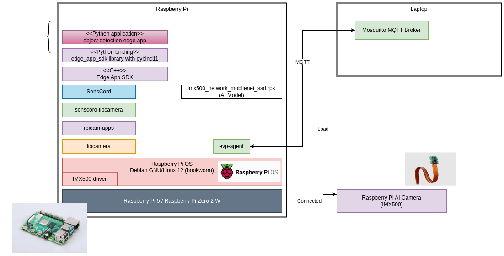

# EVP Agent & Python Edge App Setup **(Pybind11)** on Raspberry Pi

This guide covers installation, configuration, and deployment of the EVP Agent and a Python Edge App (via Pybind11) on a Raspberry Pi.



---

## Table of Contents

1. [Prerequisites](#prerequisites)
2. [Install SensCord Libcamera](#install-senscord-libcamera)
3. [Install & Configure EVP Agent](#install--configure-evp-agent)
4. [Install Python Edge App SDK](#install-python-edge-app-sdk)
5. [Prepare MQTT Broker](#prepare-mqtt-broker)
6. [Provisioning Handshake](#provisioning-handshake)
7. [Deploy Python Edge App](#deploy-python-edge-app)
8. [Verify Deployment](#verify-deployment)
9. [Change Edge App Status to Running](#change-edge-app-status-to-running)
10. [Undeploy Edge App](#undeploy-edge-app)
11. [Troubleshooting](#troubleshooting)

---

## Prerequisites

```bash
sudo apt update && sudo apt full-upgrade
sudo apt install imx500-all   # IMX500 firmware
sudo reboot now
```


## Install SensCord Libcamera

```bash
wget https://github.com/SonySemiconductorSolutions/aitrios-sdk-edge-app/releases/download/1.2.1/senscord-libcamera_1.0.7_arm64.deb
sudo apt install senscord-libcamera_1.0.7_arm64.deb
```

All files are placed in `/opt/senscord`.


## Install & Configure EVP Agent

### 1. Download & install .deb packages
Download from the GitHub Releases: https://github.com/SonySemiconductorSolutions/edge-virtualization-platform/releases/tag/releases%2Fv1.48.0

From `/tmp` to avoid permission warnings:
```bash
cd /tmp
sudo apt install ./python3-evp-app_1.0.0-1-raspios-bookworm_arm64.deb
sudo apt install ./evp-agent-1.48.0-raspios-bookworm_arm64.deb
```

### 2. Edit `/lib/systemd/system/evp-agent.service`
```ini
[Unit]
Description=Edge Virtualization Platform
After=network-online.target

[Service]
Type=exec
StandardOutput=journal
StandardError=journal
EnvironmentFile=/opt/senscord/env.conf
ExecStart=/usr/bin/evp_agent
Environment=EVP_MQTT_HOST=192.168.11.24  # MQTT broker IP
Environment=EVP_MQTT_PORT=1883
Environment=EVP_DATA_DIR=/var/lib/evp_agent
Environment=EVP_HTTPS_CA_CERT=/etc/ssl/certs/ca-certificates.crt
Environment=EVP_IOT_PLATFORM=tb          # run v2 architecture
# If using OpenCV windows:
Environment="DISPLAY=:0"
Environment="XAUTHORITY=/home/pi/.Xauthority"

[Install]
WantedBy=multi-user.target
```

Reload and start:
```bash
sudo systemctl daemon-reload
sudo systemctl enable --now evp-agent.service
journalctl -fu evp-agent
```


## Download and install Python Edge App SDK

Download from the GitHub Releases: https://github.com/SonySemiconductorSolutions/aitrios-sdk-edge-app/releases

Create and run `install-edge-app-sdk-system-wide.sh`:
```bash
#!/bin/bash
python3 -m pip install ./edge_app_sdk-0.1.0-cp311-cp311-linux_aarch64.whl --break-system-packages -v
```

```bash
chmod +x install-edge-app-sdk-system-wide.sh
sudo ./install-edge-app-sdk-system-wide.sh
```


## Prepare MQTT Broker (on PC or server)

```bash
mosquitto -c mosquitto.conf -v
```
`mosquitto.conf`:
```
allow_anonymous true
listener 1883
```


## Provisioning Handshake

From your PC:
```bash
mosquitto_pub -h localhost -p 1883 \
  -t v1/devices/me/rpc/response/10000 \
  -m '{}'
```


## Deploy Python Edge App

1. Serve your script:
   ```bash
   python3 -m http.server 8001
   ```
2. Compute hash:
   ```bash
   openssl sha256 -r object_detection_edge_app.py | cut -d' ' -f1
   ```
3. Publish deployment:
   ```bash
    mosquitto_pub \
      -h localhost -p 1883 \
      -t v1/devices/me/attributes \
      -m '{
        "deployment": {
          "deploymentId": "adec05b9275e1561ef4bf0ae0e9562386533adda7ae12fcfc1467332fe0f435f",
          "instanceSpecs":{
            "node": {
              "moduleId": "node-721f9",
              "subscribe": {},
              "publish": {}
            }
          },
          "modules": {
            "node-721f9": {
              "entryPoint": "main",
              "moduleImpl":"python",
              "downloadUrl": "http://192.168.11.24:8001/object_detection_edge_app.py",
              "hash":"76c2a97ebccf44ef1be19d0bd356f0f67f3021c815267bcf8599dd73a39fb5b8"
            }
          },
          "publishTopics": {},
          "subscribeTopics": {}
        }
      }'
   ```
   Example of a script:
   ```bash
    filename="object_detection_edge_app.py"

    hash=$(openssl sha256 -r "$filename" | cut -d' ' -f1)

    json=$(jq -n \
        --arg hash "$hash" \
        --arg filename "$filename" \
        '{
            "deployment": {
                "deploymentId": "33169145-8EB1-45AE-8267-35427323515E",
                "instanceSpecs": {
                    "node": {
                        "moduleId": "node-721f9",
                        "publish": {},
                        "subscribe": {}
                    }
                },
                "modules": {
                    "node-721f9": {
                        "entryPoint": "main",
                        "moduleImpl": "python",
                        "downloadUrl": "http://192.168.11.24:8001/\($filename)",
                        "hash": $hash
                    }
                }
            }
        }')

     mosquitto_pub -h localhost -p 1883 -t v1/devices/me/attributes -m "$json"
   ```


## Verify Deployment

Check `evp-agent` logs: you should see `status: ok` for your deployment ID.


## Change Edge App Status to Running

```bash
mosquitto_pub -h localhost -p 1883 \
  -t v1/devices/me/attributes \
  -m '{"configuration/node/edge_app": "{\"req_info\":{\"req_id\":\"run1\"},\"common_settings\":{\"process_state\":2}}"}'
```
Example of a script with configurations:
```bash
internal_json=$(jq -n \
'{
    "req_info": {
        "req_id": "process_state2"
    },
    "common_settings": {
        "log_level": 4,
        "port_settings": {
            "metadata": {
                "path": "metadata",
                "method": 2,
                "enabled": true,
                "endpoint": "http://192.168.11.24:8080",
                "storage_name": ""
            },
            "input_tensor": {
                "path": "image",
                "method": 2,
                "enabled": true,
                "endpoint": "http://192.168.11.24:8080",
                "storage_name": ""
            }
        },
        "process_state": 2,
        "codec_settings": {
            "format": 1
        },
        "inference_settings": {
            "number_of_iterations": 0
        },
        "number_of_inference_per_message": 1
    },
    "custom_settings": {
         "ai_models": {
            "detection": {
                "ai_model_bundle_id": "012345",
                "parameters": {
                    "max_detections": 2,
                    "threshold": 0.5,
                    "input_width": 300,
                    "input_height": 300,
                }
            }
        },
        "metadata_settings": {
            "format": 1
        }
    }
}' | jq -c .)

json=$(jq -n --arg internal_json "$internal_json" \
'{
    "configuration/node/edge_app": $internal_json
}' | jq -c .)

mosquitto_pub -h localhost -p 1883 -t v1/devices/me/attributes -m "$json"
```

## Undeploy Edge App

```bash
mosquitto_pub -h localhost -p 1883 \
  -t v1/devices/me/attributes \
  -m '{"deployment": {"deploymentId":"test","instanceSpecs":{},"modules":{},"publishTopics":{},"subscribeTopics":{}}}'
```

