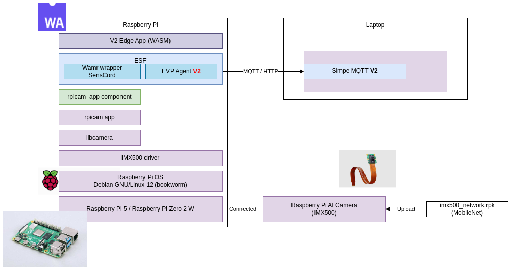

## Overview

The guide provides the instructions on how to run the Edge App on a Raspberry Pi.



## Get  Related Raspberry Pi Software

Prerequisites
Update and upgrade your system:

```
sudo apt update && sudo apt full-upgrade
```
Install the IMX500 firmware
```
sudo apt install imx500-all
```
Reboot the System
```
sudo reboot now
```


## Get the released senscord-libcamera debian package from release

```
wget https://github.com/SonySemiconductorSolutions/aitrios-sdk-edge-app/releases/download/1.2.1/senscord-libcamera_1.0.7_arm64.deb
sudo apt install senscord-libcamera_1.0.7_arm64.deb
```
Once extracted, related files are located under `/opt/senscord`

## Download the official EdgeApp Wasm from the release page

[EdgeApp public repo](https://github.com/SonySemiconductorSolutions/aitrios-sdk-edge-app/releases/download/1.2.1/sample_edge_app_detection_wasm_v2_1.2.1.zip)

## Start MQTT broker and HTTP server

Start MQTT broker in your PC
```bash
mosquitto -c mosquitto.conf -v
```
`mosquitto.conf`:
```
allow_anonymous true
listener 1883
```
and start HTTP server where the wasm is located
```bash
python3 -m http.server
```


## Start EVP agent
```
vim /opt/senscord/run_agent.sh
```
Change the IP address to where the MQTT broker running
```sh
EVP_DATA_PATH="bin/evp_data"
rm -rf "$EVP_DATA_PATH"
if [ ! -d "$EVP_DATA_PATH" ]; then
  mkdir -p "$EVP_DATA_PATH"
  echo "Directory created: $EVP_DATA_PATH"
else
  echo "Directory already exists: $EVP_DATA_PATH"
fi
export EVP_MQTT_HOST=192.168.1.106       <----- modify to your host IP
export EVP_MQTT_PORT=1883
export EVP_DATA_DIR=$EVP_DATA_PATH
# Uncomment the following lines to connect AITRIOS Console
# export EVP_MQTT_HOST=mqtt.evp2-tb.demo-jp.midokura.com
# export EVP_MQTT_PORT=8883
# export EVP_HTTPS_CA_CERT=/home/pi/evp_data/IncludedRootsPEM_20240723.txt
# export EVP_MQTT_TLS_CA_CERT=/home/pi/evp_data/root-ca.crt
# export EVP_MQTT_TLS_CLIENT_CERT=/home/pi/evp_data/client-cert.pem
# export EVP_MQTT_TLS_CLIENT_KEY=/home/pi/evp_data/client-key.pem
export EVP_IOT_PLATFORM=tb
./share/senscord/setup_env.sh ./bin/evp_agent -l ./lib/libsenscord_wamr.so -l ./lib/libesf-device-wamr.so
```
then execute
```
/opt/senscord/run_agent.sh
```

## Deploy Wasm Application

   ```bash
    mosquitto_pub \
      -h localhost -p 1883 \
      -t v1/devices/me/attributes \
      -m '{
        "deployment": {
          "deploymentId": "adec05b9275e1561ef4bf0ae0e9562386533adda7ae12fcfc1467332fe0f435f",
          "instanceSpecs":{
            "node": {
              "moduleId": "node-721f9",
              "subscribe": {},
              "publish": {}
            }
          },
          "modules": {
            "node-721f9": {
              "entryPoint": "main",
              "moduleImpl":"wasm",
              "downloadUrl": "http://192.168.11.24:8000/edge_app_detection.wasm",
              "hash":"76c2a97ebccf44ef1be19d0bd356f0f67f3021c815267bcf8599dd73a39fb5b8"
            }
          },
          "publishTopics": {},
          "subscribeTopics": {}
        }
      }'
   ```
   Example of a script:
   ```bash
    filename="edge_app_detection.wasm"

    hash=$(openssl sha256 -r "$filename" | cut -d' ' -f1)

    json=$(jq -n \
        --arg hash "$hash" \
        --arg filename "$filename" \
        '{
            "deployment": {
                "deploymentId": "33169145-8EB1-45AE-8267-35427323515E",
                "instanceSpecs": {
                    "node": {
                        "moduleId": "node-721f9",
                        "publish": {},
                        "subscribe": {}
                    }
                },
                "modules": {
                    "node-721f9": {
                        "entryPoint": "main",
                        "moduleImpl": "wasm",
                        "downloadUrl": "http://192.168.11.24:8001/\($filename)",
                        "hash": $hash
                    }
                }
            }
        }')

     mosquitto_pub -h localhost -p 1883 -t v1/devices/me/attributes -m "$json"
   ```

## Verify Deployment

Check `evp-agent` logs: you should see `status: ok` for your deployment ID.


## Change Edge App Status to Running

```bash
mosquitto_pub -h localhost -p 1883 \
  -t v1/devices/me/attributes \
  -m '{"configuration/node/edge_app": "{\"req_info\":{\"req_id\":\"run1\"},\"common_settings\":{\"process_state\":2}}"}'
```
Example of a script with configurations:
```bash
internal_json=$(jq -n \
'{
    "req_info": {
        "req_id": "process_state2"
    },
    "common_settings": {
        "log_level": 4,
        "port_settings": {
            "metadata": {
                "path": "metadata",
                "method": 2,
                "enabled": true,
                "endpoint": "http://192.168.11.24:8080",
                "storage_name": ""
            },
            "input_tensor": {
                "path": "image",
                "method": 2,
                "enabled": true,
                "endpoint": "http://192.168.11.24:8080",
                "storage_name": ""
            }
        },
        "process_state": 2,
        "codec_settings": {
            "format": 1
        },
        "inference_settings": {
            "number_of_iterations": 0
        },
        "number_of_inference_per_message": 1
    },
    "custom_settings": {
         "ai_models": {
            "detection": {
                "ai_model_bundle_id": "012345",
                "parameters": {
                    "max_detections": 2,
                    "threshold": 0.5,
                    "input_width": 300,
                    "input_height": 300,
                }
            }
        },
        "metadata_settings": {
            "format": 1
        }
    }
}' | jq -c .)

json=$(jq -n --arg internal_json "$internal_json" \
'{
    "configuration/node/edge_app": $internal_json
}' | jq -c .)

mosquitto_pub -h localhost -p 1883 -t v1/devices/me/attributes -m "$json"
```

## Undeploy Edge App

```bash
mosquitto_pub -h localhost -p 1883 \
  -t v1/devices/me/attributes \
  -m '{"deployment": {"deploymentId":"test","instanceSpecs":{},"modules":{},"publishTopics":{},"subscribeTopics":{}}}'
```
