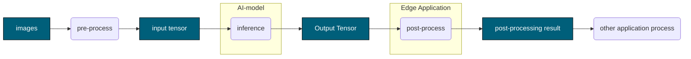
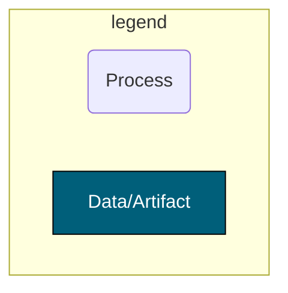

# Developing an edge application

In this set of tutorials you will learn how to design, implement and build an  "**Edge Application**" . For that you will use the C/C++ code of the sample app, the Dockerfile and the building tools. At the moment of writing this tutorial, there were four  [sample apps](../../sample_apps) available:
- [Image classification sample](../../sample_apps/classification/)
- [Object detection sample](../../sample_apps/detection/)
- [Semantic segmentation sample](../../sample_apps/segmentation/)
- [Switch dnn sample](../../sample_apps/switch_dnn/)

> **NOTE**
>
> To learn how to interact with the "**Console for AITRIOS** to import an app and deploy it to Edge AI Devices Check the [**README.md**](../2_import_edge_app/README.md).

The "**Edge Application**" has an AI-Post process that processes AI output into usable data for application development. The diagram below shows the place of the "**Edge Application**" in the whole processing pipeline of the IMX500.

<!-- mermaid alt text: Edge Application -->


<!-- mermaid alt text: Legend -->


The rest of the tutorial is structurized as follows. We start with introducing the architecture of an "**Edge Application**" in [Section 1](#1-event-based-architecture-of-edge-application). Then, in [Section 2](#2-define-dtdl-for-custom-parameters), we provide an explanation of parameters to configure an "**Edge Application**". After that, in [Section 3](#3-output-serialization-with-a-flatbuffers-schema), we explain the serialization process for the data sent from the device. To proceed, we dive into the implementation details in [Section 4](#4-implement-event-functions-for-the-edge-application). Once that is completed, [Section 5](#5-build-the-edge-application) covers the build process of the app and [Section 6](#6-run-and-debug-wasm) touches up on how to run and debug an **Edge Application**.

## 1. Event-based architecture of Edge Application

The "**Edge Application**" design is following an event-based architecture approach that allows a developer to focus on implementing only the app-specific code. To this end they should provide the event functions declared in [**`sm.h`**](../../include/sm.h). These event functions are further used by the State Machine. The life cycle of an application is depicted in the [following state diagram](../../docs/design_document.md#state-machine-diagram) that outlines the transitions and events within the Event-based architecture.

The states include Creating, Running, Idle, and Destroying, with transitions triggered by specific events. In each of this states, event functions declared in [**`sm.h`**](../../include/sm.h) are called. Here is a description of the states:

* **Creating**: The initial state where the application is created. Inside it calls the **`onCreate()`** event function and upon finishing its execution the state machine transitions to the Idle state.

* **Running**: The active state where the application is running and executing the  **`onIterate()`** event function. When creating this state, an **`onStart()`** event function is called. The state can transition back to itself, representing the continuity of the application. The transition to Idle is through the application calling **`DataExportStopSelf()`** or by a DTDL modification from the cloud. This transition triggers **`onStop()`** event function, indicating a pause in execution.

* **Idle**: A passive state indicating a paused or idle state of the application. It transitions back to itself, symbolizing the idle state's persistence. Alternatively, it transitions to Running state upon the call from the system app.

* **Destroying**: Any state can transition to the Destroying state under certain conditions. Errors or the presence of **`EVP_SHOULDEXIT`** conditions during the Running or Idle state, trigger transitions to the Destroying state. Once in the Destroying state, the **`onDestroy()`** event function is invoked, representing the final cleanup or termination of the application. After this event, the system transitions exits gracefully.

Running and Idle states call the event function **`onConfigure(char *topic, void *value, int valuelen)`** when receiving a changed DTDL from the cloud. Note that the **`topic`** will point to the **`custom_settings`** string while **`value`** will point to a string with the **`custom_settings`** field of the DTDL, for example, that will have the following structure:

```json
{
  "custom_settings": {
    "res_info": {
      "res_id": "GENERATED_STRING-tzmks",
      "code": 7,
      "detail_msg": "GENERATED_STRING-jfgfb"
    },
    "ai_models": {
      "GENERATED_STRING-tvipc": {
        "ai_model_bundle_id": "GENERATED_STRING-cvyee",
        "parameters": {
          "max_detections": 8,
          "threshold": 0.125,
          "input_width": 8,
          "input_height": 4
        }
      }
    }
  }
}
```
Here the content of **`custom_settings`** field is decided by the developers.

> **NOTE**
> 
> **`ai_model_bundle_id`** specifies which AI model on a Edge AI Device to use. The code to read and set **`ai_model_bundle_id`** in **`onConfigure(char *topic, void *value, int valuelen)`** is included in sample code.

## 2. Define DTDL for Custom Parameters

> **CAUTION**
>
>Do not edit the parameters that cannot be customized: **`req_info`**, **`res_info`** and **`common_settings`**. If you edit it, the app may not work properly.

The Custom Parameters are used to configure the "**Edge Application**". The developer can set his own settings for the app.

The DTDL of "**Edge Application**" has the following structure.

- **`edge_app`**
  - **`req_info`**
  - **`res_info`**
  - **`common_settings`**
  - **`custom_settings`**

The developers need to define the DTDL for **`custom_settings`**.<br>
See [**`edge_app_interface.json`**](edge_app_interface.json) for an example DTDL for "**Edge Application**".<br>
See also [**`DTDL Language Specification`**](https://github.com/Azure/opendigitaltwins-dtdl/blob/master/DTDL/v3/DTDL.Specification.v3.md) for DTDL specifications.

Each sample app provides DTDL and a sample of Configuration that is sent from the cloud to the app, so please refer to them.

| Sample app | DTDL | Configuration sample |
|------------|------|----------------------|
| Image classification  | [**`edge_app_ic_interface.json`**](../../sample_apps/classification/package/edge_app_ic_interface.json) | [**`configuration.json`**](../../sample_apps/classification/configuration/configuration.json) |
| Object detection      | [**`edge_app_od_interface.json`**](../../sample_apps/detection/package/edge_app_od_interface.json) | [**`configuration.json`**](../../sample_apps/detection/configuration/configuration.json) |
| Semantic segmentation | [**`edge_app_ss_interface.json`**](../../sample_apps/segmentation/package/edge_app_ss_interface.json) | [**`configuration.json`**](../../sample_apps/segmentation/configuration/configuration.json) |
| Switch DNN | [**`edge_app_switch_dnn_interface.json`**](../../sample_apps/switch_dnn/package/edge_app_switch_dnn_interface.json) | [**`configuration.json`**](../../sample_apps/switch_dnn/configuration/configuration.json) |


## 3. Output post-processing result

The "**Edge Application**" provides two format of sending post-processing result.

- Output serialization with a FlatBuffers schema
- Output json text

### 3.1. Output serialization with a FlatBuffers schema

The "**Edge Application**" is expected to provide an output serialized by [FlatBuffers](https://google.github.io/flatbuffers/index.html) and send it as a telemetry. To this end, a developer needs to define the FlatBuffers schema file (`.fbs` extension) for its "**Edge Application**" output.

Then, in order to use the FlatBuffers Schema inside the C/C++ code of the "**Edge Application**", one needs to generate the corresponding C header files. We provide a bash script [**`compile_fbs.sh`**](../../tools/compile_fbs.sh) to perform this operation. It can be used by
running the following command from the current directory in the Terminal:
```bash
$ ../../tools/compile_fbs.sh <your-schema-file> <your-output-folder-path>
```
Then, C++ header files are generated in `<your-output-folder-path>`. You can use both absolute and relative path as inputs. 

Each sample app provides an example of the sample FlatBuffers schema file and a C header file generated from the corresponding FlatBuffers schema file. A reader is welcome to check that the generated headers are exactly the same as provided in the repo (up to formatting the code).

| Sample app            | FlatBuffers Schema                                                                            | C   header                                                               |
|-----------------------|-----------------------------------------------------------------------------------------------|--------------------------------------------------------------------------|
| Image classification  | [classification.fbs](../../sample_apps/classification/schemas/classification.fbs)             | [classification_generated.h](../../sample_apps/classification/include/schemas/classification_generated.h)        |
| Object detection      | [objectdetection.fbs](../../sample_apps/detection/schemas/objectdetection.fbs)                | [objectdetection_generated.h](../../sample_apps/detection/include/schemas/objectdetection_generated.h)            |
| Semantic segmentation | [semantic_segmentation.fbs](../../sample_apps/segmentation/schemas/semantic_segmentation.fbs) | [semantic_segmentation_generated.h](../../sample_apps/segmentation/include/schemas/semantic_segmentation_generated.h) |
| Switch DNN | [switch_dnn_classification.fbs](../../sample_apps/switch_dnn/schemas/switch_dnn_classification.fbs)  and [switch_dnn_objectdetection.fbs](../../sample_apps/switch_dnn/schemas/switch_dnn_objectdetection.fbs)| [switch_dnn_classification_generated.h](../../sample_apps/switch_dnn/include/schemas/switch_dnn_classification_generated.h) and [switch_dnn_objectdetection_generated.h](../../sample_apps/switch_dnn/include/schemas/switch_dnn_objectdetection_generated.h) |

<br>

> **NOTE**
> 
> To get familiar with writing a FlatBuffers schema see the [Writing a schema](https://google.github.io/flatbuffers/flatbuffers_guide_writing_schema.html) in FlatBuffers documents.
  
<br>

> **NOTE**
>
> For detailed options of the schema compiler, **`flatc`**, utilized in [compile_fbs.sh](../../tools/compile_fbs.sh) please check [its official doccumentation](https://google.github.io/flatbuffers/flatbuffers_guide_using_schema_compiler.html).

### 3.2. Output json text

The "**Edge Application**" is also expected to provide an output as text.

Object detection sample app provides an example of output json text format.

Object detection sample app also provides an example of a binary output serialized by FlatBuffers. The output formats can be specified by `custom_settings` - `metadata_settings` - `format` in configuration json.

In [**`detection_data_processor.cpp`**](../../sample_apps/detection/data_processor/src/detection_data_processor.cpp), `DataProcessorAnalyze` makes serialized json string.

```detection_data_processor.cpp
    case EdgeAppLibSendDataJson: {
      JSON_Value *tensor_output =
          CreateSSDOutputJson(in_data, in_size / sizeof(float), analyze_params);
      *out_data = json_serialize_to_string(tensor_output);
      *out_size = json_serialization_size(tensor_output);
      json_value_free(tensor_output);
      return kDataProcessorOk;
    }
```

In [**`sm.cpp`**](../../sample_apps/detection/src/sm.cpp), `sendMetadata` calls `SendDataSyncMeta` API with data format as `EdgeAppLibSendDataJson` returned from `DataProcessorGetDataType()`.

```sm.cpp
  EdgeAppLibSendDataResult result =
      SendDataSyncMeta(metadata, metadata_size, DataProcessorGetDataType(),
                       data.timestamp, DATA_EXPORT_AWAIT_TIMEOUT);
```

## 4. Implement event functions for the "**Edge Application**"

With the event-driven architecture in place, a developer only needs to implement the folllowing event functions declared in [**`sm.h`**](../../include/sm.h) header: 
- **`onCreate()`**
- **`onConfigure(char *topic, void *value, int valuelen)`**, where **`topic`** points to the string **`custom_settings`**
- **`onIterate()`**
- **`onDestroy()`**
- **`onStop()`**
- **`onStart()`**

They are going to be called inside the state machine as explanined in [the beginning of this document](#1-event-based-architecture-of-edge-application).

In the sample apps these event functions are defined in **`sm.cpp`** file using the C++ language and, when necessary, the C header file generated in the [previous step](#2-output-serialization-with-a-flatbuffers-schema). Each sample app folder in [sample_apps](../../sample_apps/) has a similar structure which we show using a [classification sample app](../../sample_apps/classification/) as an example:
```
└── classification
    ├── include
    │   └── schemas 
    │       └── classification_generated.h
    ├── schemas 
    │   └── classification.fbs
    ├── data_processor
    │   └── src 
    │       ├── classification_data_processor.cpp
    |       ├── classification_utils.cpp
    |       ├── classification_utils.hpp
    |       └── CMakeLists.txt
    ├── src
    │   └── sm.cpp
    ├── package
    │   ├── edge_app_ic_interface.json
    │   └── manifest.json
    └── README.md
```
Here, the files [**`classification.fbs`**](../../sample_apps/classification/schemas/classification.fbs) and [**`classification_generated.h`**](../../sample_apps/classification//include/schemas/classification_generated.h) are related to the Flatbuffer schema coming from the previous step. [**`classification_utils.hpp`**](../../sample_apps/classification/data_processor/src/classification_utils.hpp) and [**`classification_utils.cpp`**](../../sample_apps/classification/data_processor/src/classification_utils.cpp) files contain different methods that a developer can find useful for parsing configuration files or for transforming data between intermediate format. Note that the code that captures how to postprocess the model is collected in the [**`classification_data_processor.cpp`**](../../sample_apps/classification/data_processor/src/classification_data_processor.cpp) and follows the Data Processor API, [**`data_processor_api.hpp`**](../../sample_apps/include/data_processor_api.hpp). While it is not a mandatory API to use, we find it to simplify the testing of the app.

The implemented code should rely on the following interfaces:
1. "**AITRIOS Data Export API**" declared in [**`send_data.h`**](../../include/send_data.h) and [**`data_export.h`**](../../include/data_export.h)<br>
2. "**AITRIOS Sensor**" declared in [**`sensor.h`**](../../include/sensor.h)<br>
3. "**Data Processor API**" (Optional) declared in [**`data_processor_api.hpp`**](../../sample_apps/include/data_processor_api.hpp)</br>

In addition, we are using some utils provided in [**`sample_apps/include`**](../../sample_apps/include/) folder.

> **NOTE**
> 
> Check the [**"API sequence diagram"**](../../docs/design_document.md#sequence-diagram) for more information.

<br>

Keep in mind the following restrictions when implementing an "**Edge Application**".
- The "**Edge Application**" is compiled to Wasm file. Features that are in [**wasi-libc**](https://github.com/WebAssembly/wasi-libc) can be used without any extra steps, but features that are not in `wasi-libc` require the libraries to be statically linked.
- Functions that require access to the Native side from WASM cannot be used. This includes, for example, OS functions, GPIO and network systems.
- Large libraries cannot be included due to a limit on the file size that can be deployed to the device. Find more information on the "**Edge Application**" memory and implementation restrictions in the [implementation requirements](https://developer.aitrios.sony-semicon.com/en/edge-ai-sensing/documents/console-v2/edge-application-implementation-requirements).
- Users are responsible for the combination of AI model and "**Edge Application**", and the system does not check beforehand.

We now invite the reader to look at the sample implementations in the [sample_apps](../../sample_apps/) folder.

## 5. Build the "**Edge Application**"

This section is split into 3 subsections corresponding to the steps that need to be performed:
- [Edit the CMakeLists](#edit-the-cmakelists)
- [Build into .wasm file](#build-into-wasm-file)
- [Clean up](#clean-up)


### Edit the CMakeLists 

When implementing a new application, you will need to prepare an application-specific **`CMakeLists.txt`**. Assuming the developer follows the proposed folder structure, they should provide:
- **`sm.cpp`** in the **`sample_apps/your_app_name/src`** folder. It is necessary for the top-level [**`CMakeLists.txt`**](../../CMakeLists.txt) to autmatically discover it at the lines: 
```CMakeLists.txt
# Add the appropriate subdirectory based on the parameter
set(EXECUTABLE_FILES ${EXECUTABLE_FILES}
  ${SAMPLE_APP_DIR}/${APPS_SELECTION}/src/sm.cpp
)
```

- **`your_app_name_schema_generated.h`** obtained in [the previous section](#3-output-serialization-with-a-flatbuffers-schema) inside the **`sample_apps/your_app_name/include/schema`**  

- additional code in **`sample_apps/your_app_name/data_procesor/src`**. <br>Note that it doesn't have to follow the Data Processor API, only to contain all the other user code except for the **`sm.hpp`**. The motivation behind puttting the additinal code into **`data_processor_api`** folder is for the top-level **`CMakeLists.txt`** to discover it as a library in the lines:
```CMakeLists.txt
add_subdirectory(${SAMPLE_APP_DIR}/${APPS_SELECTION}/data_processor/src)
set(TARGET_LIBS data_processor_api)
```

Then, under the **`sample_apps/your_app_name/data_processor/src`** folder you can create a **`CMakeLists.txt`** following the [example](../../sample_apps/classification/data_processor/src/CMakeLists.txt) for the classification sample app. For that purpose:

- Ensure that the executable files are specified in the **`add_library()`** command. Example:
```CMakeLists.txt
add_library(data_processor_api 
${SAMPLE_APP_DIR}/classification/data_processor/src/classification_data_processor.cpp
${SAMPLE_APP_DIR}/classification/data_processor/src/classification_utils.cpp
${SAMPLE_APP_DIR}/utils/src/sm_utils.cpp
${SAMPLE_APP_DIR}/utils/src/data_processor_utils.cpp
${LIBS_DIR}/third_party/parson/parson.c
${LIBS_DIR}/third_party/base64.c/base64.c
)
```
-  Provide the folders with the necessary headers to **`target_include_directories()`**. Example:
```CMakeLists.txt
target_include_directories(data_processor_api PUBLIC
  ${SAMPLE_APP_DIR}/utils/include
  ${SAMPLE_APP_DIR}/classification/include/schemas
  ${SAMPLE_APP_DIR}/classification/data_processor/src
  ${ROOT_DIR}/include
  ${LIBS_DIR}/third_party/parson
  ${LIBS_DIR}/third_party/flatbuffers/include
  ${LIBS_DIR}/third_party/base64.c
  ${LIBS_DIR}/depend/edge_app
)
```

-  statically link dependencies by adding a library name that to the **`target_link_libraries()`**. Example:
```CMakeLists.txt
target_link_libraries(data_processor_api log)
```

Now you can update the top-level [**`CMakeLists.txt`**](../../CMakeLists.txt) to work with your app by extending the **`APPS_LIST`** variable:
```CMakeLists.txt
set(APPS_LIST "classification" "detection" "zonedetection" "segmentation" "switch_dnn" "your_app_name")
```

> **NOTE**<br>
> If you use the sample "**Edge Application**", you do not need to edit the **`CMakeLists.txt`**. 
> - [Image classification](../../sample_apps/classification/data_processor/src/CMakeLists.txt)
> - [Object detection](../../sample_apps/detection/data_processor/src/CMakeLists.txt)
> - [Semantic segmentation](../../sample_apps/segmentation/data_processor/src/CMakeLists.txt)
> - [Switch dnn](../../sample_apps/switch_dnn/data_processor/src/CMakeLists.txt)


### Build into .wasm file

To build the sample applications open the Terminal and run the following command from [root](../..) containing the top-level **`CMakeLists.txt`** file:
```sh
make CMAKE_FLAGS="-DAPPS_SELECTION=${NAME_OF_APP}"
```
where **`NAME_OF_APP`** can take one of the following values:
- **`passthrough`**: build the passthrough sample (event functions defined in [here](../../sample_apps/passthrough/src/sm.cpp) of the event functions).<br>
- **`classification`** : builds the image classification sample<br>
- **`detection`** : builds the object detection sample<br>
- **`segmentation`** : builds the semantic segmentation sample<br>
- **`switch_dnn`** : builds the switch dnn sample<br>
If the flag is not specified, the app will be compiled with a passthrough implementation. 

Then, the files **`edge_app.wasm`** is generated in **`bin`** folder. Note that the output file name is independent of the application name, so the **`.wasm`**  file of the next build would overwrite the previous one.
 
> **NOTE**
> 
> The build script is prepared for building the sample. You will have to perform the following adaptation to make it work with  the "**Edge Application**" you created. 
> - Introduce your app-specific **`CMakeLists.txt`** and adapt the existing ones as specified at the [previous step](#1-optional-edit-the-cmakelists)
> - Update the top-level **`CMakeLists.txt`** [file](../../CMakeLists.txt) to use the subfolder of your app.

<br>

You can also use the **`CMAKE_FLAGS`** to customize build options. For example, to set maximum size of the linear memory to 2031616 for the classification sample app, you can call:

```sh
make CMAKE_FLAGS="-DAPPS_SELECTION=classification -DMAX_MEMORY=2031616"
```
Check "Customizing build options" for more details on available flags and their value range.

<br>

<details>
<summary>Customizing build options</summary>


The build options specified in the `CMAKE_FLAGS` are set inside the [**`config_common.cmake`**](../../cmake/config_common.cmake) file. Some of changeable options are provided in the table below. If you want to tune memory of your Wasm app, please visit [Memory model and memory usage tunning](https://github.com/bytecodealliance/wasm-micro-runtime/blob/main/doc/memory_tune.md) and [Build WASM applications](https://github.com/bytecodealliance/wasm-micro-runtime/blob/main/doc/build_wasm_app.md). Please understand that there are limitation to the amount of memory that can be used in total.


| Flag               | description                                         | default              | limitation             | setting in the [`config_common.cmake` file](../../cmake/config_common.cmake)     |
| --------------- | --------------------------------------------------- | -------------------- | ---------------------- | ------------ |
| `STACK_SIZE`      | specify stack size of<br>thread (aux stack area)    | not set              | 16 [byte] alignment    | `ADDITIONAL_FLAGS`<br>`-z stack-size=${STACK_SIZE}`  |
| `INITIAL_MEMORY`  | specify initial usage of<br>memory size (libc heap) | not set              | 65536 [byte] alignment | `ADDITIONAL_FLAGS`<br>`-Wl, --initial-memory=${INITIAL_MEMORY}`  |
| `MAX_MEMORY`      | maximum size of the<br>linear memory                | 2097152 [byte]<br>(max) | reduce only (from default)<br />65536 [byte] alignment<br />max : 2097152 [byte]<br />min : see formula below | `-Wl,--max-memory=${MAX_MEMORY}`    | 

<br>

**Formula for a minimum value of `--max-memory`:** *min_max-memory = (AI Model Output Data Size x 2) + Your Application Heap Size + STACK_SIZE*

</details>

### Clean up
Open the terminal at the [folder](../..) containing the top-level **`CMakeLists.txt`**[top folder](../../) and run one of the following commands depending on what you want to remove:

- To remove the generated Wasm file from `bin` folder:
```bash
$ make clean
```

- To remove the generated object files, libraries and Wasm files:
```bash
$ make cleanall
```

## 6. Run and debug Wasm

We provide a setup to debug WASM on Edge AI Devices.

You can retrieve logs of Wasm running on a Edge AI Device. For that purpose we provide a Log API among the libraries available to a developer. For detailed information about logs, see [implementation requirements](https://developer.aitrios.sony-semicon.com/en/edge-ai-sensing/documents/console-v2/edge-application-implementation-requirements). The ["**Console User Manual**"](https://developer.aitrios.sony-semicon.com/en/edge-ai-sensing/documents/console-v2/console-user-manual/) covers how to enable Wasm logging and retrieve logs.

> **NOTE**
> 
> The sample code **`sm.cpp`** includes [**`logger.h`**](../../include/logger.h), but [**`logger.h`**](../../include/logger.h) will be removed from "**Edge Application SDK**". To make it easier to migrate to new versions in the future, please include [**`log.h`**](../../include/log.h) instead of [**`logger.h`**](../../include/logger.h) when developing your apps.

> **TIP**
> 
> You can check the retrieved logs from "**Console UI**".<br>
> To use this feature, you need to import Wasm to "**Console for AITRIOS**" and deploy it to a Edge AI Device. 


## References
- [FlatBuffers](https://google.github.io/flatbuffers/index.html)<br>
The version of FlatBuffers used in "**Edge Application SDK**" is 23.1.21

- [WASI SDK](https://github.com/WebAssembly/wasi-sdk)<br>
The version of WASI SDK used in "**Edge Application SDK**" is wasi-sdk-22
