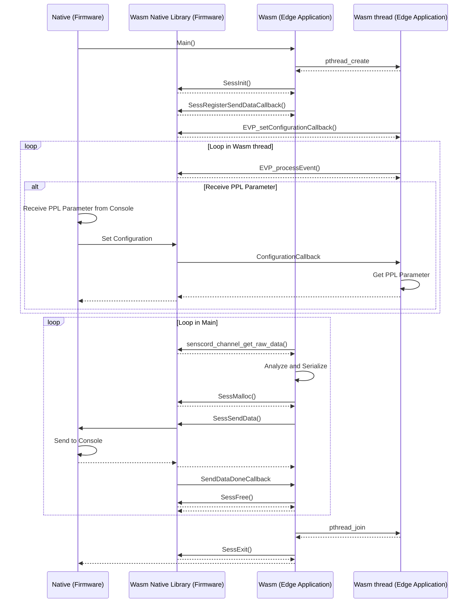
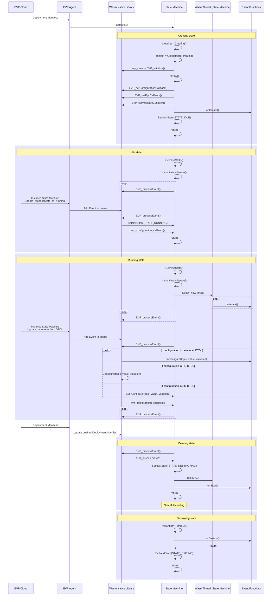

# "**Edge Application**" Migration Guide from SDK v1.0

If you have already developed the "**Edge Application**" using [SDK v1.0](https://github.com/SonySemiconductorSolutions/aitrios-sdk-vision-sensing-app),
you need to modify the source code of the "**Edge Application**" to migrate to this SDK.

## Overview

In SDK v1.0, the "**Edge Application**" can:

- Customize behavior by changing parameters using **`PPLParameter`** in Command Parameter File of StartUploadInferenceData
- Receive and analyze IMX500 Output Tensor data
- Upload the analyze Metadata of inference result
- Customize a whole behavior, such as sequence and timing of getting Output Tensor, analyzing and uploading by custom implementation in event loop

Additionally, in this SDK, the "**Edge Application**" can:
- Control the upload of the Input Tensor data from the "**Edge Application**"

While in SDK a developer can as well customize the application behavior and configure the workflow, large portion of the communication logic is now encapsulated in the internal state machine implementation, leaving a user with a task of implementing the processing steps inside the event functions. 

Regarding the parameters take into account the following modifications: 
-  **`PPLParameters`** are replaced with the Custom Parameters in the DTDL configurations
- **`NumberOfImages`** is replaced by **`number_of_iterations`** in the [DTDL configuration](edge_app_interface.json#L244) 
- **`NumberOfInferencesPerMessage`** is replaced by **`number_of_inference_per_message`** in the [DTDL configuration](edge_app_interface.json#L787) 
- **`UploadInterval`** has been removed. Frequency of upload for inference and images now will correspond to the calls of **`DataExportSendData()`** that depends on the developers implementation. Upload interval cannot be adjusted anymore by the parameters defined under common_settings in DTDL

## Sequence of SDK v1.0

Wasm has a main loop and a thread. Wasm functions are called from Wasm and Native callback.

> **NOTE**
>
> This sequence is based on the processing of the sample object detection code. The set of called methods varies depending on the logic of the sample app.

<!-- mermaid alt text: Sequence of SDK v1.0 -->

## Sequence of this SDK

> **NOTE**
>
> This sequence is based on the processing of the [sample object detection](../../sample_apps/detection) code.

<!-- mermaid alt text: Sequence of SDK v1.0 -->

## Migration steps

The sample code of "**Edge Application**" in SDK v1.7 is implemented to reproduce behavior of such in SDK v1.0. We further illustrate the migration steps using the object detection example in the SDK v1.0 [sample applications](https://github.com/SonySemiconductorSolutions/aitrios-sdk-vision-sensing-app/tree/v1.0.6/tutorials/4_prepare_application/1_develop/sdk/sample) and detection "**Edge Application**" in SDK v1.7 [sample application](../../sample_apps).

> **Note**  
> We provide a minor change related to versioning in the header. In particular, the previously present check of the id and version of the header is eliminated. It is not related to the internal logic of the SDK.

1. Place your FlatBuffers `.fbs` file in the [`schemas` folder](../../sample_apps/detection/schemas)

2. Regenerate FlatBuffers header file.  
   Please see [ Output serialization with a FlatBuffers schema](README.md#2-output-serialization-with-a-flatbuffers-schema). Specify `<your-output-folder-path>`, the folder path to the generated header file, to be [include/schemas](../../sample_apps/detection/include/schemas/) of your app.

3. Migrate to use AitriosDataExport API. 
   Replace the [following logic from SDK v1.0](https://github.com/SonySemiconductorSolutions/aitrios-sdk-vision-sensing-app/blob/v1.0.6/tutorials/4_prepare_application/1_develop/sdk/vision_app_sdk/include/vision_app_public.h#L191-L204) with the one provided in AitriosDataExport functions from the [`data_export.h`](../../include/data_export.h).

    

    
Public data export functions.

    | SDK v1.0                         | SDK v2.0                                      |
    |----------------------------------|-----------------------------------------------|
    | `SessInit`                       | Not available                                 |
    | `SessExit`                       | Not available                                 |
    | `SessSendData`                   | `DataExportSendData`                   |
    | `SessMalloc`                     | Not available, use `malloc` from `<stdlib.h>` |
    | `SessFree`                       | `DataExportCleanup`                    |
    | `SessRegisterSendDataCallback`   | Not available                                 |
    | `SessUnregisterSendDataCallback` | Not available                                 |

    SDK v2.0 introduced the following new functions:

    | Function                     | description                                                      |
    |------------------------------|------------------------------------------------------------------|
    | `DataExportSendState` | Send state asynchronously.                                       |
    | `DataExportAwait`     | Waits for the completion of an asynchronous operation.           |
    | `DataExportStopSelf`  | notifies state machine to transition from Running to Idle state. |

    

     

4. Migrate to use AitriosSensor API instead of Senscord from `vision_app_public.h`. 
    Introduce AitriosSensor functions from the [`sensor.h`](../../include/sensor.h) instead of their Senscord contraparts in SDK v1.0 [example](https://github.com/SonySemiconductorSolutions/aitrios-sdk-vision-sensing-app/blob/v1.0.6/tutorials/4_prepare_application/1_develop/sdk/vision_app_sdk/include/vision_app_public.h#L139-L189).

    

    
Public senscord functions.

    | SDK v1.0                                     | SDK v2.0                                     |
    |----------------------------------------------|----------------------------------------------|
    | `senscord_core_init`                         | `AitriosSensorCoreInit`                      |
    | `senscord_core_exit`                         | `AitriosSensorCoreExit`                      |
    | `senscord_core_open_stream`                  | `AitriosSensorCoreOpenStream`                |
    | `senscord_core_close_stream`                 | `AitriosSensorCoreCloseStream`               |
    | `senscord_stream_start`                      | `AitriosSensorStart`                         |
    | `senscord_stream_stop`                       | `AitriosSensorStop`                          |
    | `senscord_stream_get_frame`                  | `AitriosSensorGetFrame`                      |
    | `senscord_stream_release_frame`              | `AitriosSensorReleaseFrame`                  |
    | `senscord_stream_get_property`               | `AitriosSensorStreamGetProperty`             |
    | `senscord_stream_set_property`               | `AitriosSensorStreamSetProperty`             |
    | `senscord_stream_register_frame_callback`    | `AitriosSensorStreamRegisterFrameCallback`   |
    | `senscord_stream_unregister_frame_callback`  | `AitriosSensorStreamUnregisterFrameCallback` |
    | `senscord_frame_get_channel_from_channel_id` | `AitriosSensorFrameGetChannelFromChannelId`  |
    | `senscord_channel_get_raw_data`              | `AitriosSensorChannelGetRawData`             |
    | `senscord_channel_get_property`              | `AitriosSensorChannelGetProperty`            |
    | `senscord_get_last_error` -> level           | `AitriosSensorGetLastErrorLevel`             |
    | `senscord_get_last_error` -> cause           | `AitriosSensorGetLastErrorCause`             |
    | `senscord_get_last_error` -> message         | `AitriosSensorGetLastErrorString`            |

    

     

5. Split the logic between event functions. 
    In the SDK v1.0 the entrypoint of the application is the **`main()`** function provided by a developer. In the SDK v1.7 the workflow is represented by the state machine calling the event functions declared in [**`sm.h`**](../../include/sm.h). Thus, to shift to the newer version, the developer then has to split the [original code](https://github.com/SonySemiconductorSolutions/aitrios-sdk-vision-sensing-app/blob/v1.0.6/tutorials/4_prepare_application/1_develop/sdk/sample/vision_app/single_dnn/objectdetection/src/vision_app_objectdetection.cpp) into [the elements](../../sample_apps/detection/src/sm.cpp) that belong to the event functions. The table below provides refences to the code snippets.

    

    
Correspondence between the lines of the original code and the event functions.

    | SDK v1.7      | SDK v1.0 |  Used functionality |
    |---------------|----------|---------------------|
    | [`onCreate()`](../../sample_apps/detection/src/sm.cpp#L139-L161)  | [L112-L133](https://github.com/SonySemiconductorSolutions/aitrios-sdk-vision-sensing-app/blob/v1.0.6/tutorials/4_prepare_application/1_develop/sdk/sample/vision_app/single_dnn/objectdetection/src/vision_app_objectdetection.cpp#L112-L133) of `main()` | `AitriosSensorCoreInit`, `AitriosSensorCoreOpenStream`, `AitriosSensorStreamRegisterFrameCallback` |
    | [`onStart()`](../../sample_apps/detection/src/sm.cpp#L227-L246) | [L126-L151](https://github.com/SonySemiconductorSolutions/aitrios-sdk-vision-sensing-app/blob/v1.0.6/tutorials/4_prepare_application/1_develop/sdk/sample/vision_app/single_dnn/objectdetection/src/vision_app_objectdetection.cpp#L126-L151) of `main()` |   `AitriosSensorStart`, `AitriosSensorImageCropProperty`, `AitriosSensorStreamGetProperty` | 
    | [`onIterate()`](../../sample_apps/detection/src/sm.cpp#L188-L214) | [L162-L234](https://github.com/SonySemiconductorSolutions/aitrios-sdk-vision-sensing-app/blob/v1.0.6/tutorials/4_prepare_application/1_develop/sdk/sample/vision_app/single_dnn/objectdetection/src/vision_app_objectdetection.cpp#L162-L234) of `main()` |  `AitriosSensorGetFrame`, `AitriosSensorFrameGetChannelFromChannelId`, `AitriosSensorChannelGetRawData`, `AitriosDataExportSendData`, `AitriosDataExportAwait`, `AitriosDataExportCleanup`, `AitriosSensorReleaseFrame` `DataProcessorAnalyze` |
    | [`onStop()`](../../sample_apps/detection/src/sm.cpp#L216-L225) | [L244-L255](https://github.com/SonySemiconductorSolutions/aitrios-sdk-vision-sensing-app/blob/v1.0.6/tutorials/4_prepare_application/1_develop/sdk/sample/vision_app/single_dnn/objectdetection/src/vision_app_objectdetection.cpp#L244-L255) of `main()` |   `AitriosSensorStop` |
    | [`onDestroy()`](../../sample_apps/detection/src/sm.cpp#L248-L267) | [L236-L269](https://github.com/SonySemiconductorSolutions/aitrios-sdk-vision-sensing-app/blob/v1.0.6/tutorials/4_prepare_application/1_develop/sdk/sample/vision_app/single_dnn/objectdetection/src/vision_app_objectdetection.cpp#L236-L269) of `main()` | `AitriosSensorStreamUnregisterFrameCallback`, `AitriosSensorCoreCloseStream`,  `AitriosSensorCoreExit` |
    | [`onConfigure()`](../../sample_apps/detection/src/sm.cpp#L163-L186) | [`ConfigurationCallback()`](https://github.com/SonySemiconductorSolutions/aitrios-sdk-vision-sensing-app/blob/v1.0.6/tutorials/4_prepare_application/1_develop/sdk/sample/vision_app/single_dnn/objectdetection/src/vision_app_objectdetection.cpp#L348-L402) | `DataProcessorConfigure` (parse the custom parameter json and sets the configuration parameters), `DataExportSendState` (updates the custom parameters in DTDL) |

    

     

6. Build "**Edge Application**". 
   See [Build the "**Edge Application**"](README.md#build-the-edge-application)

